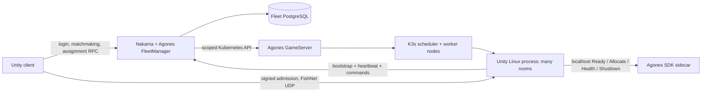

# Independent K3s + Agones implementation plan

## Scope and repository boundaries

`nakama-agones` owns the Go FleetManager, Kubernetes provider, database migration, deployment manifests, local integration harness and releases. `agones-server-nakama-plugin-unity` owns server lifecycle/admission helpers and authenticated Nakama client helpers. Both have their own histories, tests, tags and releases. The original PlayFlow repositories and current game deployment remain independently usable.

The first release is one region / one manually versioned pool. It manages **processes on already joined VPS nodes**, not Tencent billing resources. A multi-room Unity process remains one Allocated GameServer throughout its useful life. Room counts and reconnect reservations remain durable Nakama business state. Counters/Lists and GameServerAllocation are not required.

## Lifecycle contract

1. A pair enters Nakama matchmaking with matching region and manual compatibility version. Reject incompatible tickets before queueing. Keep content build digest separate from protocol compatibility.
2. Prefer healthy existing processes with room capacity; if needed and below the hard process limit, persist launch intent then create a deterministic owned GameServer and credential Secret. Reconcile ambiguous responses by identity instead of blindly creating duplicates.
3. The game binds UDP, reads SDK identity/port configuration, initializes its business host and external result storage, bootstraps once, calls SDK Ready then Allocate, and verifies Allocated. Only then may heartbeats expose business readiness.
4. `prepare_room` is acknowledged before issuing a short signed seat ticket. Validate signature, identity, room, epoch, roster, seat and nonce in the game before associating the transport connection.
5. Heartbeats include actual rooms, occupants, frame interval, simulation backlog, audit backlog and pending durable results. Lost contact closes admission. Retry exact heartbeat sequences safely; never silently drop live nonce or command fences.
6. Reconnect reserves the same room/seat for a bounded interval. A new process boot cannot take over old rooms. Drain blocks new rooms while preserving eligible existing reconnects.
7. Scale down only an idle process after cooldown. Drain waits for rooms, reconnect holds, simulations, results and audits to reach zero; confirm an empty heartbeat before SDK Shutdown. Deletion is ownership- and UID-guarded.
8. On node/process failure, fail affected allocations visibly. The first version does not promise live physics-state migration or reconnect to a replacement process.

## Stages and acceptance

| Stage | Deliverable | Acceptance |
| --- | --- | --- |
| 1. Independent adapters | Go provider and Unity lifecycle package | Original repositories unchanged; separate names, RPC paths, env prefixes, DB table, assembly names and Unity GUIDs; unit/security contract tests |
| 2. Reproducible integration | Isolated k3d + real Agones + Nakama 3.41.0 | Match real websocket clients, share two rooms/process, scale another process, signed UDP fixture admission, cancel, resume after Nakama restart, drain, clean resources |
| 3. DM integration | Explicit Agones profile and game host adapter | FishNet auth before gameplay, Game_Online match/cancel/reconnect/rematch/leave, durable results, client/server manual version parity; PlayFlow profile still selectable |
| 4. Tencent pilot | One control node and one amd64 game node | Private API access, externally reachable UDP address/port, node join, HTTPS control callbacks, image pull, graceful update/rollback, backups and restore drill |
| 5. Capacity and operations | Hardware-specific limits and dashboards | Staged real game load plus real clients; report p99 frame/input/stop-to-ready, queue age, CPU throttling/steal, network, results and cleanup; alert and draining controls |
| 6. Resilience | More game nodes and HA if justified | Kill one game node under load, preserve unaffected matches, refuse stale admission, expand only within available resources; 3 K3s server nodes if etcd HA is required |

Stages 3–6 require the actual game build, selected VPS networking and hardware. A protocol fixture or portable C# test is not evidence that DM gameplay has passed those stages. See the dated validation record for executed checks.

## Scheduling and capacity policy

Start with small measured limits (for example 4 rooms/process for an initial experiment), not the prior overloaded 128-room ceiling. Set realistic CPU/memory requests; monitor CPU throttling before imposing CPU limits. One Unity process can bottleneck a main thread even when the node has idle cores. Compare multiple smaller processes per node against one larger process.

The first controller uses existing free capacity, a min/max process count and idle cooldown. It blocks unhealthy/backlogged admission using the current business metrics. It does **not** yet implement a predictive CPU/p99 autoscaler. Before enabling that phase, collect a calibrated capacity curve for each server model, reserve operating headroom, and add hysteresis, sustained threshold windows and launch-rate limits. All scaling must include reservation/reconnect occupancy and pending shutdown work.

When Kubernetes cannot schedule another process, surface waiting/capacity failure; do not buy VPSs automatically. Alert on long Pending time, failed image pulls, room queue age and minimum warm capacity. Join additional worker VPSs through the private control network after provisioning, label them for the pool, and let K3s place eligible GameServers.

## Networking and security

Use a private/VPN control network. Game UDP takes each worker's public address and a reserved hostPort range; test from a real external device. Do not put game UDP behind an HTTP proxy. Configure node external IPs deliberately and allow only the required game UDP range publicly. Restrict Kubernetes API, kubelet and overlay ports to trusted nodes/operators.

Use TLS/CA validation and rotating service-account token files, scoped namespace RBAC, Secrets for all injected environment values, image digests for production and no client access to operator/provider credentials. Namespace RBAC cannot express ownership labels: dedicate a namespace/trust boundary to this controller. Encrypt Kubernetes Secrets at rest and secure etcd/snapshot backups. Headlamp must use scoped login and private access, not a public cluster-admin token.

## Release and rollback

Publish independent checksummed release artifacts and GHCR images with source revision and exact Nakama compatibility metadata. Pin production by digest. To roll out a new game image, create a separate pool/deployment identity, direct compatible new matches to it, and drain the old pool. Do not mutate a live pool's persistent profile or reset its database to bypass mismatch validation. Rolling back control code must preserve the stored schema; test migration compatibility and restore paths before production changes.
