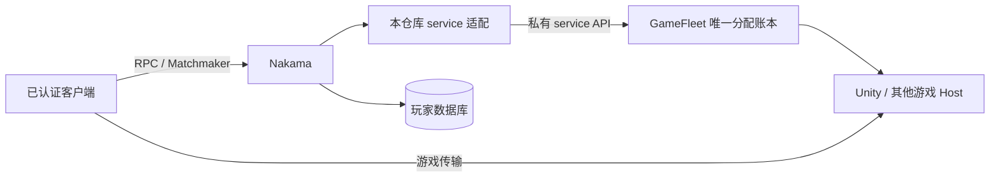
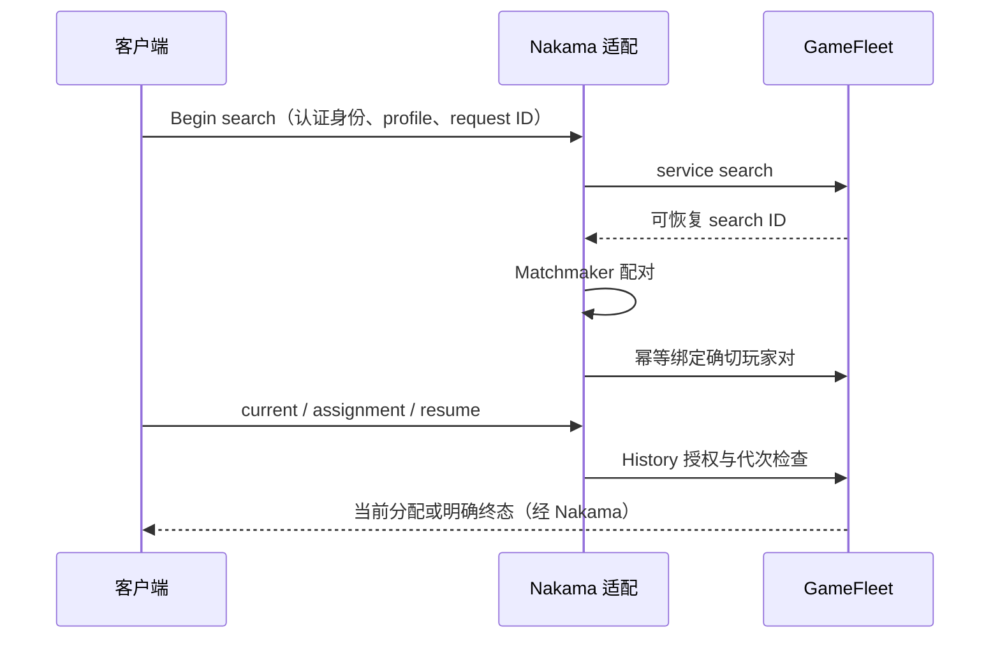

# Nakama 适配架构

本页是本仓库唯一架构说明。当前游戏采用 `gamefleet-service` 模式；完整参数及路由只维护在 [service runtime](gamefleet-service-runtime.md)，不在此复制。平台内部架构见 [GameFleet](https://github.com/xuhuanhello/selfhosted-gamefleet/blob/codex/production-nakama-admission/docs/architecture.md)。

## 职责与控制权

Nakama 提供身份、会话和配对；适配器负责将可信身份和幂等请求映射到平台。GameFleet 负责授权、发布选择、资源预留、票据代次与持久化状态。Host 负责实际房间 prepare、玩家连接与 close。任何一层的“请求成功”都不能伪造下一层的完成确认。

service 模式不直接管理 Kubernetes、购买机器、持有节点 SSH，也不维护可独立分配房间的第二本账。游戏规则、邮箱/经济系统和结算是应用职责，不应硬编码在公共适配器。

## 匹配与恢复

普通匹配信号不等于房间已经准备好。current/status/assignment/resume 的请求必须保持协议规定的 ID 与代次；网络超时不允许换一套身份重新分配。取消先表达意图，房间释放必须由真实生命周期完成。

## 身份与版本

service 使用独立 `gfsvc_` 凭据，普通 caller 使用 `gfbiz_` 凭据，两者不能混用。search grant、match grant 和 History source route 分别授权；启动 preflight 不能替代每次请求的资源/参与者检查。

region、compatibility 与 identity issuer 都是精确契约。镜像版本号不能自动改变这些值。发布切换后旧 allocation 的历史身份与终态仍由其原始账本来源校验，不把历史只读权限扩展成新分配权限。

当前适配器 URL 契约限定 loopback HTTP origin。跨主机部署需要受保护、可恢复的转发，并从 Nakama 实际网络 namespace 验证；公网玩家 HTTPS 入口与该私有 API 不是同一个监听器。

## 模式与安装边界

一个 Nakama 运行时只注册一个 FleetManager 和 matched hook。`agones` 旧模式自行编排独立 GameServer；普通 `gamefleet` 绑定 caller；`gamefleet-service` 使用独立 service 身份和授权路由。安装时显式选择，不能同时运行多套控制器管理同一资源。

平台先于此适配部署，授权和发布路由准备好后才能开放匹配。编译需匹配官方 Nakama 的 Go/依赖 ABI，应用所需其他插件须进入同一兼容组合镜像；不能为升级适配器漏掉账号插件。

架构描述、空机流程和历史证据分开：当前代码支持不等于目标机器已经安装；正式游戏的既有成功也不等于新安装可复现。发现遗漏时修改本页或所属协议页，不再新建同内容的阶段架构副本。
