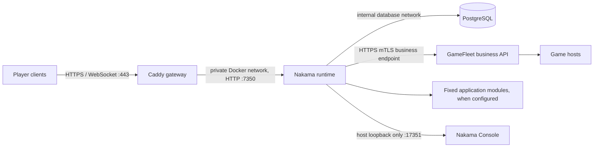
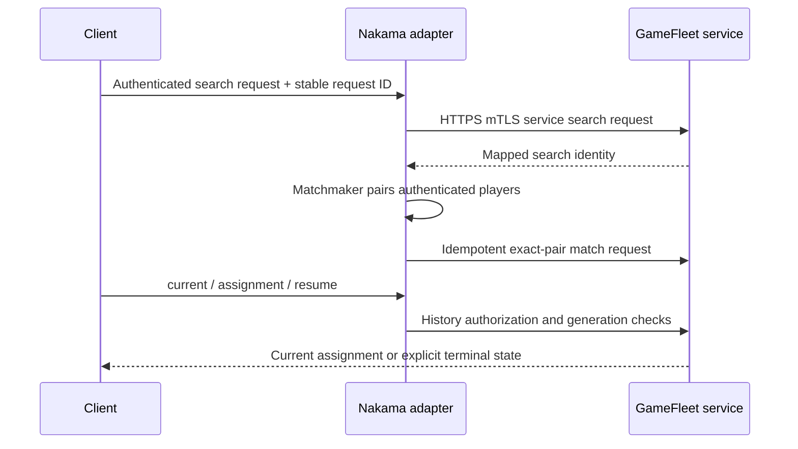

# Nakama GameFleet service architecture

The currently implemented deployment path is one Linux host running the Compose stack in the [deployment guide](deployment.md). This repository connects Nakama to GameFleet through the `gamefleet-service` adapter. The GameFleet platform is installed and operated separately.

## Service transport requirements

These requirements govern adapter code, startup checks, configuration validation and deployment templates. Changes require an update and review here before implementation; there must be no implicit transport fallback.

1. With verified private reachability, use the configured private HTTPS business endpoint. Same-region placement is not proof of routing or access. Keep server certificate validation and service identity/scope authorization.
2. For a cross-region HTTP API without private routing, use a dedicated public HTTPS business endpoint with mTLS and the existing service authorization. Do not expose or reuse administrator, database, image-upload or Kubernetes interfaces.
3. A managed private network, site VPN or Tailscale may supply reachability when multiple services require it. It does not replace application identity or authorize all tailnet peers. Record routes, ACLs, relay/control dependencies and key lifecycle.
4. Production service calls must not depend on an SSH sidecar, shared loopback network namespace or an operator's SSH session. SSH remains an administration/node-installation tool.
5. Inject endpoint, trusted CA and client identity through deployment configuration and read-only secret files. Do not bake them into images, force a loopback origin or disable certificate checks. The `gfsvc_` service credential remains distinct from TLS identity.
6. Timeouts and retries are bounded; retries retain the original request ID, allocation and generation. Reconnection must not silently create a replacement room. Readiness must check the required business dependencies, not just a listening local port.

Release acceptance must cover startup and real service flows without any SSH sidecar; private route/DNS/TLS validation from Nakama's container; public mTLS rejection of missing, wrong and expired identities; scope denial; endpoint isolation; network loss, process restart and certificate rotation; idempotence and absence of plaintext/source fallback. Overlay networks, when selected, additionally require direct/relay and control-service/key-expiry failure tests. Unverified transport changes block release.

The adapter and Compose deployment use explicit direct HTTPS with mutual TLS. Runtime startup checks the authenticated search and History scopes before registering player hooks. Local tests do not substitute for release acceptance on the selected production network.

## Ownership

Nakama authenticates players, runs Matchmaker, and derives participant identity from its authenticated runtime context. The adapter maps those trusted identities and stable request IDs to GameFleet service endpoints. GameFleet owns service grants, profile selection, room allocation, tickets, generations, and the durable allocation ledger. A game host owns prepare, player admission, gameplay, and close evidence.

The owner-issued `gfsvc_` service key and TLS client private key are separate read-only files. TLS authenticates the machine connection; the service key and exact scope authorize each business operation. Neither secret enters images, environment values or logs.

## Network boundaries

The frontend Docker bridge carries Caddy-to-Nakama HTTP and outbound business HTTPS. PostgreSQL is attached only to a separate `internal: true` bridge shared with Nakama. Caddy is the only public service and publishes TCP 80/443 plus optional HTTP/3 UDP 443. It proxies player APIs and WebSockets to Nakama port 7350. The embedded console is bound to host loopback at `127.0.0.1:17351`; use an operator SSH tunnel to open it remotely.

Nakama API/gRPC ports are not published directly. Nakama connects to the configured dedicated business HTTPS origin using a trusted CA and client certificate. This endpoint must expose only business routes, not administrative, upload, database or Kubernetes interfaces. Private routing is preferred when verified; public cross-region traffic also requires mTLS. No SSH sidecar or shared network namespace participates.

Caddy removes any incoming `X-DM-Client-IP` value and sets it from the direct TLS peer address. Fixed's optional account module must trust only the Caddy container's exact static IPv4 `/32` (default `172.29.240.2/32`) via `DM_ACCOUNT_TRUSTED_PROXY_CIDRS`. If the Caddy address changes, update the application setting with it. Do not trust the full Docker subnet.

## Request and recovery flow

Search, pair matching, and History access are separate grants. Startup preflight does not replace per-request authorization. A timeout must retain its original request ID and ledger pointer; it must not silently select another source or allocate a fallback room.

## Runtime image and state

The Fixed application image is supplied by its build helper and pinned by either a local Docker image ID or a complete OCI digest. The Nakama repository provides the matching `agones.so` adapter runtime target. When account login is enabled, the Fixed build adds `account.so` and the deployment preflight verifies both files. The Nakama repository accepts additional required module filenames through `APPLICATION_REQUIRED_MODULES`; it does not bake application-specific account fields into the generic Compose stack.

PostgreSQL owns Nakama player and runtime schema. The named Docker volume persists its data. The database password and Nakama server/session/runtime/console keys are generated into host files under `private/`; the Nakama entrypoint renders the secret-bearing YAML only into a container tmpfs before migrations and server startup. Caddy's certificate state persists in a separate named volume. Compose status alone does not establish GameFleet reachability, account login, matchmaking, or production health.
