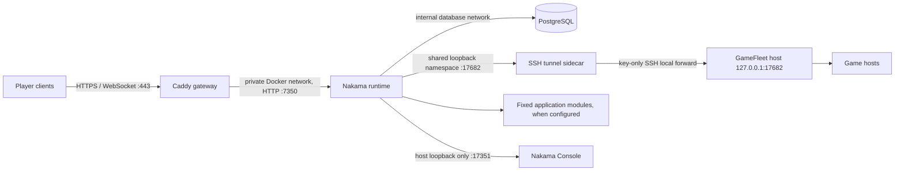
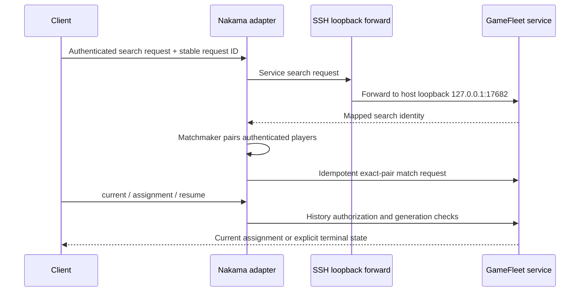

# Nakama GameFleet service architecture

The supported deployment path is one Linux host running the Compose stack in the [deployment guide](deployment.md). This repository connects Nakama to GameFleet through the `gamefleet-service` adapter. The GameFleet platform is installed and operated separately.

## Ownership

Nakama authenticates players, runs Matchmaker, and derives participant identity from its authenticated runtime context. The adapter maps those trusted identities and stable request IDs to GameFleet service endpoints. GameFleet owns service grants, profile selection, room allocation, tickets, generations, and the durable allocation ledger. A game host owns prepare, player admission, gameplay, and close evidence.

The service credential is separate from the SSH tunnel credential. Nakama reads the owner-issued `gfsvc_` key from a read-only secret file. The SSH sidecar uses a separate key restricted on the GameFleet host to the single `127.0.0.1:17682` destination. Neither key is placed in a container image, `.env`, command argument, or chat.

## Network boundaries

The frontend Docker bridge carries Caddy-to-Nakama HTTP and outbound SSH. PostgreSQL is attached only to a separate `internal: true` bridge shared with Nakama. Caddy is the only public service and publishes TCP 80/443 plus optional HTTP/3 UDP 443. It proxies player APIs and WebSockets to Nakama port 7350. The embedded console is bound to host loopback at `127.0.0.1:17351`; use an operator SSH tunnel to open it remotely.

Nakama API/gRPC ports are not published directly. The GameFleet business listener is not exposed through Caddy or Docker port mapping. A small SSH sidecar shares Nakama's network namespace, listens only on its `127.0.0.1:17682`, and forwards to the platform host's loopback listener. Nakama therefore keeps the adapter's exact loopback URL contract while the service crosses hosts through an authenticated, host-key-verified path.

Restarting or replacing Nakama interrupts that shared-loopback tunnel while the sidecar reconnects. Automatic recovery does not provide seamless failover or a high-availability guarantee.

Caddy removes any incoming `X-DM-Client-IP` value and sets it from the direct TLS peer address. Fixed's optional account module must trust only the Caddy container's exact static IPv4 `/32` (default `172.29.240.2/32`) via `DM_ACCOUNT_TRUSTED_PROXY_CIDRS`. If the Caddy address changes, update the application setting with it. Do not trust the full Docker subnet.

## Request and recovery flow

Search, pair matching, and History access are separate grants. Startup preflight does not replace per-request authorization. A timeout must retain its original request ID and ledger pointer; it must not silently select another source or allocate a fallback room.

## Runtime image and state

The Fixed application image is supplied by its build helper and pinned by either a local Docker image ID or a complete OCI digest. The Nakama repository provides the matching `agones.so` adapter runtime target. When account login is enabled, the Fixed build adds `account.so` and the deployment preflight verifies both files. The Nakama repository accepts additional required module filenames through `APPLICATION_REQUIRED_MODULES`; it does not bake application-specific account fields into the generic Compose stack.

PostgreSQL owns Nakama player and runtime schema. The named Docker volume persists its data. The database password and Nakama server/session/runtime/console keys are generated into host files under `private/`; the Nakama entrypoint renders the secret-bearing YAML only into a container tmpfs before migrations and server startup. Caddy's certificate state persists in a separate named volume. Compose status alone does not establish GameFleet reachability, account login, matchmaking, or production health.
